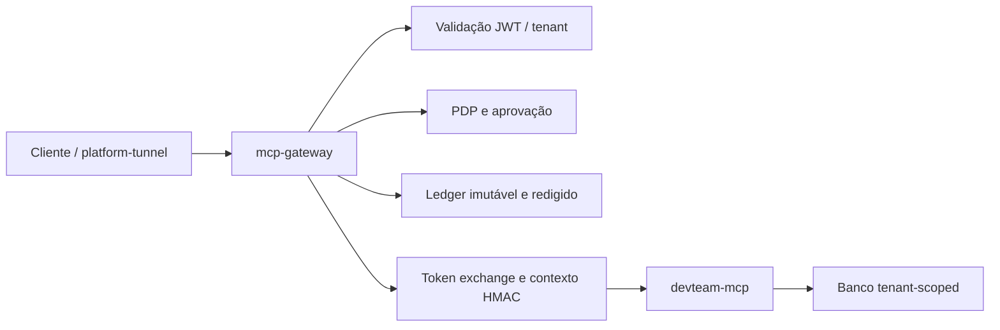

# platform-devs

Control plane dos MCPs do DevTeam da plataforma DataForAll. O repositório mantém o
provedor consolidado `devteam-mcp`, o gateway de autenticação/autorização, o registry
somente leitura e o catálogo operacional que gera os artefatos de runtime.

GitHub Actions foi aposentado neste ecossistema. Validação e entrega são executadas em
host controlado e registradas por `session-mcp`; `pipeline-mcp` mantém gates e histórico,
mas não executa CI/CD.

## Fonte de verdade

Os arquivos editáveis e canônicos são:

- `manifests/mcps/*.yaml`: provedores existentes e seus estados de ciclo de vida;
- `manifests/planned/*.yaml`: catálogo de produto sem runtime;
- `contracts/tools/*.yaml`: contratos e classificação de risco das tools governadas;
- `src/control_plane/`: loader, validações, inventário e projeções determinísticas.

Não edite manualmente `.mcp.json`, `docker-compose.yml`,
`generated/mcp-runtime-registry.json`, `docs/generated/mcp-catalog.md` ou os schemas em
`schemas/`. Gere-os novamente a partir dos manifests:

```powershell
python scripts/generate_mcp_artifacts.py
python scripts/generate_mcp_artifacts.py --check
```

## Estado atual

- `devteam-mcp`: provedor consolidado experimental; o código está endurecido, mas ficou
  fora do runtime porque a suíte atual comprova apenas 28% contra o gate de 80%;
- `mcp-gateway`: PEP ativo, fail-closed, com PDP externo, token exchange, contexto
  assinado, rate limit e ledger imutável;
- `mcp-registry`: descoberta ativa e somente leitura;
- `auth-mcp`, `scheduler-mcp` e `connectors-mcp`: experimentais e fora dos artefatos de
  runtime até comprovarem o contrato de contexto assinado e tenant derivado;
- `cache-mcp`: desabilitado até possuir transporte HTTP autenticado;
- manifests em `manifests/planned/`: somente catálogo, sem tools, compose, registry ou
  `.mcp.json`.

O catálogo completo e gerado está em
[`docs/generated/mcp-catalog.md`](docs/generated/mcp-catalog.md).

## Fluxo de execução



O gateway rejeita contexto, tenant, flags de aprovação e material secreto enviados em
argumentos. Tools críticas exigem decisão de policy e IDs de aprovação verificados. O
provedor consolidado já revalida o inner token e a assinatura do contexto, mas só será
promovido a `active` após atingir o gate de testes sem reduzi-lo.

## Desenvolvimento local

Requisitos: Python 3.12, Docker Compose, PostgreSQL, Redis protegido por senha e endpoints
reais para JWKS, PDP e token exchange. As variáveis obrigatórias e o rollback estão em
[`docs/architecture/mcp-control-plane.md`](docs/architecture/mcp-control-plane.md).

Para testar a ponte local já configurada pelo `platform-tunnel`:

```powershell
dftunnel mcp check
```

O `.mcp.json` gerado fica vazio enquanto não houver provedor stdio direto seguro. Isso é
intencional: o acesso local passa pelo `platform-tunnel` e pelo gateway, não por wrappers
que exponham schemas vazios ou simulem sucesso.

Validações do control plane:

```powershell
python scripts/validate_mcp_manifests.py
python scripts/audit_mcp_inventory.py
python scripts/generate_mcp_artifacts.py --check
python -m pytest tests/control_plane -q
```

Validações dos componentes alterados:

```powershell
python -m pytest mcp-gateway/tests -q
python -m pytest services/cache-mcp-server/tests/test_server.py -q
python -m pytest devteam-mcp-server/tests/test_aggregator.py -q
```

## Documentação

- [`docs/architecture/mcp-control-plane.md`](docs/architecture/mcp-control-plane.md):
  limites, invariantes, configuração, migração e rollback;
- [`docs/mcp-discovery.md`](docs/mcp-discovery.md): descoberta local e artefatos gerados;
- [`AGENTS.md`](AGENTS.md): política operacional obrigatória do ecossistema.

## Licença

Proprietary — DataForAll.
