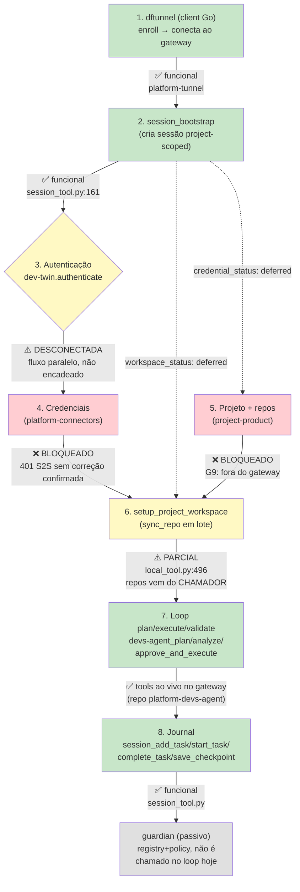

# Jornada DevTeam — estado E2E real (2026-07-22)

Mapa do fluxo ponta-a-ponta **como ele existe hoje no código**, não como o ADR-017
projeta. Cada etapa cita `arquivo:linha`; nada aqui é aspiracional. Complementa (não
substitui) `ADR-017-DEVTEAM-JOURNEY.md`, `connectors-devteam-journey.md` e
`devteam-journey-crossrepo.md` — este documento é o "onde estamos", os outros são o
"o que falta pedir a quem".

## Diagrama



🟢 funcional · 🟡 parcial/desconectado · 🔴 bloqueado cross-repo · ⚪ existe mas passivo

## Passo a passo

### 1. `dftunnel` (client) — 🟢 funcional

Binário Go estático (`CGO_ENABLED=0`), instalado via MSI com um código de enrollment
de uso único embutido. No 1º run troca o código por `{url, pat, mcp_path}` via
`POST /api/v1/client/enroll` e grava em `~/.dataforall/{config,credentials}` (perm
`0600`). Conecta ao edge (`tunneld`) via WSS/TLS multiplexado (yamux); o edge fala
com o control-plane FastAPI. É a "ponte MCP" do tenant: modo A local (stdio) ou modo
B cloud (URL HTTPS pública) para IDEs/agentes (Claude Code, Cursor, ChatGPT).
Fonte: `platform-tunnel/README.md:3-42,71`,
`platform-tunnel/docs/design/onboarding-zero-config.md:10-11,22-38,50-67`,
`platform-tunnel/docs/design/agent-integrations.md:1-9,22,37-63`.

⚠️ Pendência própria do platform-tunnel (não bloqueia o resto): Fase 3 (build WiX do
instalador) marcada como pendente por falta de toolchain no ambiente
(`onboarding-zero-config.md:86-87`) — fora do escopo deste documento, é do time
dono do tunnel.

### 2. `session_bootstrap` — 🟢 funcional

`devteam-mcp-server/src/domains/session/tools/session_tool.py:161-170`:

```python
async def session_bootstrap(
    store: SessionStore, default_base_branch: str, *,
    project_id: str, agent_client: str | None = None,
    environment: dict[str, Any] | None = None,
    title: str | None = None, objective: str | None = None,
) -> dict[str, Any]:
```

Cria uma sessão **project-scoped** de verdade (`start_session(..., project_id=...)`),
capturando `agent_client`/`environment` que o CLIENTE envia — não introspecção
server-side (ADR-017 D17.5, porque o devteam-mcp roda remoto). Retorno exato
(`session_tool.py:192-200`):

```python
{
    "session_id": ..., "project_id": ..., "agent_client": ...,
    "environment_captured": bool(environment),
    "credential_status": "deferred",   # aponta pra etapa 4, bloqueada
    "workspace_status": "deferred",    # aponta pra etapa 6, parcial
    "session": {...},
}
```

O próprio retorno já documenta, em runtime, que os passos 4 e 6 não estão resolvidos
aqui dentro — não é um "TODO" escondido, é um contrato explícito da tool.

### 3. Autenticação (`dev-twin`) — 🟡 fluxo DESCONECTADO (achado desta sessão)

`devteam-mcp-server/src/domains/dev-twin/tools/auth_tool.py:42-109`:
`authenticate(store, token)` valida um **token opaco de "twin"** (não JWT — comentário
no código: "TWIN_TOKEN do ambiente", linha 52) contra `TokenStore.validate()`. Existem
também `whoami()` (linhas 112-134), `get_twin_context()` (linhas 137-179, cache 60s) e
`context_status()` (linhas 182-226, métricas de uso).

**Achado**: nada em `session_tool.py` chama `dev-twin.authenticate`, e nada em
`auth_tool.py` referencia `session_bootstrap`. São dois fluxos paralelos e
desacoplados hoje. Na prática isso significa que `session_bootstrap` cria uma sessão
sem checar se o `agent_client` está autenticado via twin token — a ordem
"autentica → depois faz bootstrap" precisa ser garantida pelo CHAMADOR (o
`dftunnel`/cliente), não é enforced pelo servidor. Isso não é um bug per se (pode ser
intencional — cada tool sendo independente e componível), mas é uma lacuna de fiação
que vale uma decisão explícita: ou `session_bootstrap` passa a exigir/verificar um
twin token válido, ou a documentação da jornada deixa claro que a ordem é
responsabilidade do client.

### 4. Credenciais (`platform-connectors`) — 🔴 bloqueado, confirmado sem progresso

Nenhuma chamada a `resolve_credential`/`get_credential_runtime`/
`list_credential_platforms` em lugar nenhum do devteam-mcp (grep vazio, confirmado
nesta sessão). O 401 de S2S reportado em `connectors-devteam-journey.md` (Entrega 3,
pré-requisito de tudo) não tem evidência de correção — `git log` dos docs cross-repo
não mudou desde a sessão que os escreveu.

### 5. Projeto + repos (`project-product`) — 🔴 bloqueado (G9)

`project-product-mcp-server` existe no monorepo mas não está registrado no gateway —
devteam-mcp não tem como buscar bindings de projeto ao vivo. `RepositoryBindingRecord`
+ `external_link` (Fatia A, ADR-017 D17.6) estão implementados no lado
`project-product`, mas inacessíveis daqui até G9 ser feito.

### 6. `setup_project_workspace` — 🟡 parcial (implementado nesta sessão)

`devteam-mcp-server/src/domains/deploy/tools/local_tool.py:496-558`. Orquestra
`sync_repo` (linhas 395-494, clone-or-pull idempotente, nunca descarta trabalho sujo)
sobre uma lista de repos **fornecida pelo CHAMADOR** — não resolvida a partir de
`project_id`, exatamente porque os passos 4 e 5 estão bloqueados. Autenticação usa
`settings.github_token` (mesmo caminho de `clone_repo`/`sync_repo`, violação de D17.2
já pré-existente, não nova). TODO explícito no docstring para quando `resolve_repo_clone`
existir: a função pode passar a aceitar só `project_id`, sem quebrar quem já chama
com `repos` explícito.

### 7. Loop plan/execute/validate — 🟢 tools ao vivo (repo separado)

O runtime de orquestração (`plan`/`analyze`/`approve_and_execute`/`resume_execution`/
`list_personas`/`list_runbooks`) **não vive mais no `platform-devs`** — foi movido pro
repo standalone `platform-devs-agent` (commit `cf69a7e`: "chore(repo): runtime movido
para o repo standalone platform-devs-agent"). Esse repo não está clonado localmente
neste ambiente, mas existe e teve push recente no GitHub
(`dataforalltech/platform-devs-agent`, `pushedAt: 2026-07-18`), e as tools aparecem
ao vivo no catálogo do gateway hoje (`devs-agent_plan`, `devs-agent_analyze`,
`devs-agent_approve_and_execute`, `devs-agent_resume_execution`,
`devs-agent_list_personas`, `devs-agent_list_runbooks`) — confirma o que a memória de
sessões anteriores já registrava (B0-B7 completo e deployado em HML).

Nota de higiene (não urgente): sobraram `__pycache__/*.pyc` órfãos em
`platform-devs/platform-dev-agent/app/dev_agent/` do código antigo antes da mudança —
não são fonte perdida (o `git log` confirma a migração intencional), só lixo de build
que pode ser limpo.

### 8. Journal (tasks/checkpoints) — 🟢 funcional

`session_tool.py` — `add_task`/`start_task`/`approve_task`/`complete_task`/
`fail_task`/`cancel_task`/`save_checkpoint`/`list_tasks`/`get_task`. `complete_task`
**exige** `commit_sha`+`commit_message` (não faz o commit, só persiste a prova de que
o agente já commitou via `deploy`). `approve_task`/`fail_task`/`cancel_task` gravam
audit trail via `store.record_decision`. Isso é o D17.10 (bridge de journal) já
funcionando do lado servidor — falta só o lado cliente automatizar as chamadas em vez
de depender de convenção manual do agente.

### Guardian no loop — ⚪ existe, mas passivo (por design)

Zero menções a guardian em `session/` ou `deploy/` (grep vazio). Isso é esperado:
ADR-018 D18.9 declara o guardian como **"registro + política, NÃO executor"** — a
autoridade de gate é pipeline/qa/pre-commit/boot, que ingerem resultado no guardian
(`record_check_result`) e consultam conformidade (`check_compliance`). Não é uma
lacuna a corrigir — é a divisão de responsabilidade decidida no ADR-018.

## Resumo — o que funciona, o que não funciona, o próximo desbloqueio real

| # | Etapa | Status | Bloqueador |
|---|-------|--------|------------|
| 1 | dftunnel enroll+conexão | 🟢 funcional | — |
| 2 | session_bootstrap | 🟢 funcional | — |
| 3 | dev-twin authenticate | 🟡 desconectado | decisão de fiação (client-side ou server-side) |
| 4 | credenciais via connectors | 🔴 bloqueado | `platform-connectors`: 401 S2S + `resolve_credential` |
| 5 | projeto+repos via project-product | 🔴 bloqueado | G9: registrar project-product no gateway |
| 6 | setup_project_workspace | 🟡 parcial | depende de 4+5 pra virar completo |
| 7 | loop plan/execute/validate | 🟢 tools ao vivo | — (repo `platform-devs-agent`) |
| 8 | journal (tasks/checkpoints) | 🟢 funcional | falta só automação client-side |
| — | guardian no loop | ⚪ passivo por design | não é lacuna, é decisão do ADR-018 |

**Único desbloqueio que resolve 2 blockers de uma vez**: corrigir o 401 de S2S no
`platform-connectors` (Entrega 3 de `connectors-devteam-journey.md`) — é
pré-requisito tanto de `resolve_credential` (etapa 4) quanto, indiretamente, do que
permitiria acelerar G9 (etapa 5, hoje puramente uma questão de ops/deploy, não de
código).
