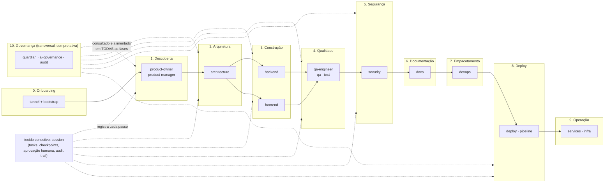

# Jornada de produto/operação do usuário DevTeam

Complementa `devteam-journey-e2e-current-state.md` (que mapeia o fluxo TÉCNICO de
conexão/bootstrap) com a jornada de PRODUTO: quem é o usuário, o que ele entrega, com
que ferramentas, apoiado por qual processo. Base factual: inventário completo dos 21
domínios / ~400 tools do `devteam-mcp-server` (levantado nesta sessão, sem
capacidade inventada — cada tool citada existe hoje no catálogo).

## Quem é o usuário DevTeam

**Não é um desenvolvedor sozinho numa IDE.** É uma pessoa (fundador solo, tech lead,
ou um time pequeno) que opera um **time de engenharia virtual** — um agente de IA
(Claude Code ou Codex, conectado via `platform-tunnel`) que, através do devteam-mcp,
tem acesso a ~400 tools especializadas organizadas como se fossem colegas de um time
real: um Product Manager, um Product Owner, um Arquiteto, um Backend Engineer, um
Frontend Engineer, um QA Engineer, um Security Engineer, um DevOps Engineer — cada um
com memória própria persistida (dual-db, tenant-scoped), não um chat que esquece
tudo a cada sessão.

O usuário DevTeam não escreve código diretamente nas tools — ele **conversa com o
agente**, que traduz a intenção em chamadas às tools certas, na ordem certa,
respeitando os gates de aprovação humana e as diretrizes de governança. O valor do
devteam-mcp não é "mais uma IDE com IA" — é o agente ter **institucionalização**: o
que foi decidido, planejado, testado e aprovado fica gravado e consultável, não se
perde entre sessões.

## O ciclo de vida — 10 fases + 1 tecido conectivo

---

### 0. Onboarding — conectar o agente

**Entrega:** sessão de trabalho ativa, project-scoped, com ambiente capturado.
**Ferramentas:** `dftunnel` (client) → `session.session_bootstrap` →
(⚠️ `dev-twin.authenticate` hoje desconectado — ver `devteam-journey-e2e-current-state.md`).
**Processo:** já mapeado em detalhe no documento técnico E2E — não repetido aqui.

### 1. Descoberta — o que construir e por quê

**Entrega:** visão de produto, personas de usuário, MVP escopado, backlog priorizado
por RICE, user stories prontas para arquitetura.
**Ferramentas:**
- `product-owner`: `set_product_vision`, `save_user_persona`, `set_mvp_scope`,
  `generate_user_stories`, `save_backlog_item` (score RICE automático),
  `generate_epic`, `generate_feature_breakdown`.
- `product-manager`: `save_feature_spec`, `calculate_rice_score`,
  `generate_acceptance_criteria` (Gherkin), `save_gtm_brief` (go-to-market),
  `generate_handoff_to_architecture` — o artefato que fecha esta fase e abre a próxima.

**Processo/apoio:** `session.add_task` registra cada decisão de escopo como task;
`ai-governance.get_agent_guidelines` pode ser consultado já aqui se a feature tocar
área sensível (auth, dados, billing).

### 2. Arquitetura — como construir

**Entrega:** blueprint de arquitetura, diagrama C4, ADR da decisão técnica principal,
blueprint de solução ligando a feature aos sistemas existentes.
**Ferramentas:** `architecture.save_architecture_blueprint`,
`generate_c4_diagram`/`generate_sequence_diagram` (Mermaid),
`generate_adr`, `save_solution_blueprint`.
**Processo/apoio:** `ai-governance.query_ecosystem_graph`/`find_dependencies_of`/
`find_consumers_of` — antes de decidir, o agente consulta o grafo real de serviços
pra não propor algo que já existe ou que quebra um consumidor. `guardian.create_directive`
se a decisão virar um ADR normativo de plataforma (não só desta feature).

### 3. Construção — backend e frontend em paralelo

**Entrega:** contrato de API, schema de banco, política de auth, router/service/
repository scaffolded; componentes React, páginas, formulários, tipos TS, cliente de
API.
**Ferramentas:**
- `backend`: `generate_api_contract` → `save_api_contract`, `generate_database_schema`
  → `save_database_schema`, `generate_auth_policy`, `generate_fastapi_router`,
  `generate_service_layer`, `generate_repository_layer`, `generate_migration`,
  `generate_event_contracts`.
- `frontend`: `generate_react_component`, `generate_nextjs_page`,
  `generate_typescript_types` (a partir do contrato de API do backend — acoplamento
  natural entre as duas trilhas), `generate_form_with_validation`, `generate_api_service`,
  `create_design_tokens`.

**Processo/apoio:** `ai-governance.validate_agent_decision` a cada decisão de risco
(bloqueia fallback silencioso, hardcode, bypass de auth); `ai-governance.validate_lib_change`
se tocar uma lib privada compartilhada (hard stop, não é sugestão); `session.start_task`/
`complete_task` (exige `commit_sha`+`commit_message` — a prova de que o código foi
realmente commitado, não só gerado) por cada unidade de trabalho.

### 4. Qualidade — provar que funciona

**Entrega:** plano de teste, casos de teste, suíte automatizada (unit/e2e/api),
relatório de cobertura, veredicto de prontidão.
**Ferramentas:**
- `qa-engineer` (planejar): `save_test_plan`, `generate_gherkin_scenarios`,
  `generate_unit_tests`, `generate_e2e_tests`, `generate_api_tests`,
  `generate_playwright_tests`/`generate_cypress_tests`, `save_test_case`.
- `qa` (executar): `run_unit_tests`, `run_e2e_tests`, `run_api_tests`,
  `check_accessibility`, `visual_regression`, `run_linter`, `run_type_check`,
  `get_coverage_report`, `generate_qa_report` (score/grade agregado).
- `test` (exploratório/manual, quando automação não cobre): `create_test_plan`,
  `run_checklist`, `add_bug`, `double_check` — veredicto explícito
  APROVADO/BLOQUEADO.

**Processo/apoio:** `pipeline.add_gate_result`/`get_gate_status` — os resultados de
QA viram gate formal de promoção, não só um relatório solto.

### 5. Segurança — antes de expor

**Entrega:** modelo de ameaças (STRIDE), matriz de controles, avaliação CVSS de
vulnerabilidades achadas, spec de segurança da API.
**Ferramentas:** `security.save_threat_model`, `generate_security_controls`,
`set_security_control`, `save_cvss_assessment` (score/severidade automáticos),
`generate_api_security_spec`, `generate_compliance_report`.
**Processo/apoio:** alimenta `guardian.set_conformance_control` — o resultado da
avaliação de segurança vira estado de conformidade rastreável por projeto, com
`create_waiver` se uma falha precisar de exceção temporária (sempre com validade e
aprovador, nunca isenção silenciosa).

### 6. Documentação — deixar rastro

**Entrega:** README/CHANGELOG/runbooks atualizados, score de qualidade documental.
**Ferramentas:** `docs.generate_doc` (templates), `validate_doc`, `check_links`,
`check_required_docs`, `audit_repo`, `find_stale_docs`, `generate_doc_report`.
**Processo/apoio:** se o documento for uma diretriz normativa (não descritiva de um
repo específico), o destino é `guardian.create_directive`, não `docs` — a distinção
já está decidida no ADR-018 (`docs` = descritivo por repo; `guardian` = normativo de
plataforma).

### 7. Empacotamento — preparar pra rodar em produção

**Entrega:** Dockerfile, docker-compose, manifesto K8s, módulo Terraform, Helm chart,
pipeline GitHub Actions.
**Ferramentas:** `devops.generate_dockerfile`, `generate_docker_compose`,
`generate_kubernetes_manifest`, `generate_terraform_module`, `generate_helm_chart`,
`generate_github_actions_pipeline`; persistidos via `save_artifact`/`save_pipeline`.
**Processo/apoio:** `infra.terraform_validate`/`terraform_plan`/`policy_scan_checkov`/
`cost_estimate_infracost` — antes de aplicar infra nova, valida sintaxe, política e
custo.

### 8. Deploy — colocar no ar

**Entrega:** PR mergeado, imagem publicada, deploy registrado, promoção
dev→homol→prod com aprovação humana onde exigido.
**Ferramentas:** `deploy.create_pr`/`merge_pr`, `trigger_workflow`, `deploy` (dispara
por ambiente), `setup_repo`/`acr_build` (build+push de imagem), `ensure_all_repos_healthy`.
**Processo/apoio:** `pipeline.promote_service` — checa gates (QA, segurança,
conformidade) antes de abrir o PR de promoção; `approve_promotion` — aprovação humana
explícita antes do merge para homol/prod; `rollback` se algo quebrar.

### 9. Operação — manter rodando

**Entrega:** serviço registrado e monitorável, saudável, com logs acessíveis.
**Ferramentas:** `services.register_service`, `check_health`/`check_all_health`,
`launch_service`/`stop_service`/`reload_service`, `get_service_logs`/`search_logs`,
`register_infra`/`kafka_status`/`redis_status`.
**Ferramentas de capacidade:** `infra.request_vm`/`list_pool`/`query_capacity` — se a
operação precisar de mais capacidade computacional (lease de VM sob demanda).

### 10. Governança — transversal, nunca uma fase isolada

Ao contrário das fases 1-9 (que acontecem em sequência por feature), governança está
**sempre ativa**, consultada e alimentada em paralelo:
- `ai-governance` — guarda-corpo em tempo real: `validate_agent_decision` antes de
  decisões de risco, `get_pre_execution_checklist` antes de tocar arquivos,
  `get_forbidden_actions` como lista negra, `get_audit_log` como trilha auditável.
- `guardian` — registro normativo: diretrizes versionadas (princípios/ADRs/standards),
  matriz de rastreabilidade (o que cada ADR implica em standard/arquitetura/runbook),
  conformidade por projeto e waivers com validade obrigatória.
- `session` — o tecido conectivo de tudo: cada task, checkpoint e decisão de qualquer
  uma das 10 fases fica registrado aqui, com gate de aprovação humana
  (`add_task(needs_human_decision=True)` → `approve_task`) para o que exigir
  julgamento humano antes de prosseguir.

---

## Apoio e processo — o que garante que isso não vira caos

1. **Aprovação humana como gate, não como sugestão.** `session.add_task` com
   `needs_human_decision=True` bloqueia `start_task` até `approve_task` registrar
   `decision="go"` — não é um checkbox decorativo, o servidor recusa prosseguir.
2. **Nada de fallback silencioso.** `ai-governance.validate_agent_decision` existe
   especificamente para bloquear o agente tomando atalhos (hardcode, bypass de auth,
   fallback sem log) — decisão errada não passa despercebida.
3. **Credenciais nunca na mão do agente.** Regra dura já documentada
   (`ADR-017 D17.2`): sempre via `platform-connectors` — hoje parcialmente bloqueado
   (ver `devteam-journey-e2e-current-state.md`), mas a intenção arquitetural é essa.
4. **Conformidade é estado, não vibe.** `guardian.set_conformance_control` exige
   evidência quando "pass" e motivo quando não — não dá pra marcar "ok" sem
   justificar.
5. **Cada entrega tem dono e rastro.** Todo domínio de produto (`product-owner`/
   `product-manager`/`backend`/`frontend`/`qa-engineer`/`security`/`devops`) persiste
   em tabelas tenant-scoped versionadas — não é markdown solto que se perde.

## O que NÃO existe ainda (não inventar)

Esta jornada de produto/operação descreve capacidades REAIS do catálogo — mas duas
lacunas já mapeadas em `devteam-journey-e2e-current-state.md` afetam o fluxo inteiro:
credenciais (fase "onboarding") e resolução de projeto→repos (afeta a fase 0 antes de
qualquer fase de produto começar). Nenhuma das 10 fases de produto acima depende
diretamente desses dois blockers — elas operam sobre um `project_id`/sessão já
existente — mas a AUTOMAÇÃO ponta-a-ponta (sem intervenção manual pra apontar
`repos_root`/token) continua esperando o desbloqueio do `platform-connectors`.
