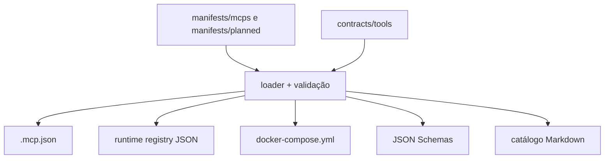

# Control plane MCP manifest-driven

**Status:** implementado
**Data:** 2026-07-18

## Objetivo e limites

O `platform-devs` controla o código do `devteam-mcp`, `contracts-mcp`,
`artifact-provenance-mcp` e as superfícies comuns de gateway e descoberta. O provedor
consolidado permanece `experimental`; os dois providers novos estão ativos porque suas
tools publicadas possuem contratos, schemas de entrada/saída e testes de comportamento. MCPs
pertencentes a outros domínios permanecem em seus repositórios de origem. Todos só são
promovidos para `active` depois de comprovar os mesmos invariantes de segurança e teste.

`platform-catalog` continua sendo o catálogo de capabilities, operações, tools e
providers do ecossistema. Os manifests desta arquitetura são a fonte operacional para
runtime, rede, ciclo de vida e policy overlays; não substituem aquele domínio.

## Fontes e projeções



As projeções são determinísticas. `scripts/generate_mcp_artifacts.py --check` falha se
um arquivo gerado divergir da fonte canônica.

Para runtimes locais, o Compose gerado preserva `command` + `args`, usa o
`health_ready` declarado no manifest e materializa dependências e companions. Builds
privados declaram IDs em `runtime.build_secrets`; o gerador cria `build.secrets` e o
secret de topo apontando para `${<ID>_FILE:?required}`. `build_ssh` e `build_secrets`
são mutuamente exclusivos, para impedir que um manifest misture duas fontes de
credencial de build.

## Invariantes de segurança

1. Provedor ativo que expõe tools exige autenticação, tenant, PDP fail-closed, audit,
   redação de segredos e contexto assinado.
2. O tenant vem de claims verificados; `tenant_id` em argumentos é rejeitado.
3. Aprovação não é booleano do request. O gateway envia IDs ao PDP e só propaga os IDs
   devolvidos na decisão verificada.
4. O gateway troca o token frontal por inner token com audiência `mcp:<provider>`.
5. O contexto contém actor, tenant, papéis, scopes, ambiente, correlação, causação,
   sessão, decisão e aprovações; o payload é assinado com HMAC.
6. O provedor revalida inner token, audiência, tenant, decisão e assinatura antes de
   executar. Isso vale para o `devteam-mcp` e para o runtime seguro compartilhado de
   `contracts-mcp` e `artifact-provenance-mcp`, que exige `aud == mcp:<provider>` e
   falha fechado quando não há material de verificação configurado.
7. Falha de registry, PDP, token exchange, rate limit ou ledger bloqueia a chamada.
8. Argumentos são inspecionados recursivamente; contexto não confiável e campos de
   segredo não são encaminhados.
9. O ledger PostgreSQL é append-only, redigido e encadeado por hash. UPDATE e DELETE são
   bloqueados por trigger.
10. Tools que devolviam chave privada SSH ou credencial direta são removidas da
    descoberta e bloqueadas por contrato.

## Tools de alto risco

Os overlays em `contracts/tools/` cobrem, entre outros:

- provisionamento de VM (`infra_request_vm`): alto risco, aprovação N2;
- chave SSH e leitura direta de credencial: desabilitadas;
- `cache_clear_all`: desabilitada e removida do servidor local;
- SQL ad-hoc, drop e truncate: críticos, N2, mantidos fora do runtime enquanto
  `connectors-mcp` estiver experimental;
- troca de senha no conector: desabilitada até aceitar referência opaca;
- execução de scheduler: alto risco, N2, fora do runtime experimental.

## Configuração obrigatória

O compose usa `${VAR:?required}` para não iniciar com defaults inseguros.

| Grupo | Variáveis |
|---|---|
| Identidade | `GATEWAY_AS_ISSUER`, `GATEWAY_AS_JWKS_URL`, `GATEWAY_RESOURCE` |
| Runtime dos provedores | `MCP_CONTEXT_SIGNING_KEY`, `MCP_INNER_TOKEN_ISSUER`, `MCP_INNER_TOKEN_JWKS_URL` (ou `MCP_INNER_TOKEN_PUBLIC_KEY`) |
| Policy | `GATEWAY_PDP_URL`, `GATEWAY_RATE_LIMITS_JSON` |
| Delegação | `GATEWAY_TOKEN_EXCHANGE_URL`, `GATEWAY_CONTEXT_SIGNING_KEY` |
| Ledger runtime | `POSTGRES_USER`, `POSTGRES_PASSWORD`, `POSTGRES_DB` |
| Rate limit | `REDIS_PASSWORD` |
| Build privado | `GITHUB_TOKEN_FILE` (arquivo local entregue ao BuildKit como `github_token`) |
| DevTeam DB | `DB_ENGINE`, `DB_HOST`, `DB_PORT`, `DB_NAME`, `DB_USER`, `DB_PASSWORD` |
| Tenant resolver | `ADMIN_DB_HOST`, `ADMIN_DB_PORT`, `ADMIN_DB_USER`, `ADMIN_DB_PASSWORD` |

Valores reais ficam em secret store ou ambiente controlado. `.env` com segredo não é
versionado.

Exemplo não sensível de rate limit:

```json
{
  "default": {"per_second": 5, "per_month": 1000},
  "developer": {"per_second": 20, "per_month": 10000},
  "admin": {"per_second": 100, "per_month": 100000}
}
```

## Migração

1. valide os manifests e gere as projeções;
2. configure JWKS, PDP, token exchange, PostgreSQL, Redis e bancos do DevTeam;
3. aplique `mcp-gateway/migrations/001_immutable_audit.sql` com uma identidade de
   migração separada; o usuário runtime não deve possuir DDL, UPDATE, DELETE ou TRUNCATE;
4. suba primeiro dependências, depois `devteam-mcp`, gateway e registry;
5. verifique `/v1/health/ready` do gateway e do registry;
6. execute uma tool somente leitura com tenant real e confirme os eventos `authorized`
   e `success` no ledger;
7. confirme que tools desabilitadas retornam 403 e não chegam ao provedor;
8. promova provedores experimentais individualmente, após testes de contrato no repo
   proprietário.

## Rollback

O rollback seguro é por artefato e manifest:

1. pare o novo gateway sem apagar o ledger;
2. reverta os manifests e regenere as projeções a partir do commit anterior;
3. restaure o roteamento anterior no `platform-tunnel` pelo processo operacional do
   repositório proprietário;
4. mantenha `mcp_activity_ledger` para auditoria — não execute DROP/DELETE;
5. só reative um provedor após diagnosticar a dependência que causou o fail-closed.

O wrapper legado `mcp-http-wrapper.py` não deve ser restaurado: ele publicava schemas
vazios e podia representar ausência de resultado como sucesso.

## Verificação

```powershell
python scripts/validate_mcp_manifests.py
python scripts/audit_mcp_inventory.py
python scripts/audit_mcp_tools.py --fail-on-runtime-gaps
python scripts/generate_mcp_artifacts.py --check
python -m pytest tests/control_plane -q
python -m pytest mcp-gateway/tests -q
```

Builds de container e smoke tests com integrações reais exigem as variáveis da tabela
acima. Falta de configuração é falha esperada, não motivo para inserir fallback.
