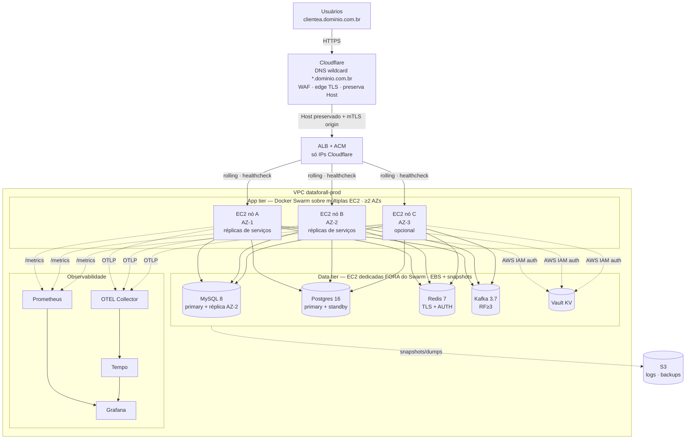

# Stack Oficial e Arquitetura Definitiva — Plataforma DataForAll

**Versão:** 2026-07-04 · **Status:** Baseline oficial (aprovar na direção técnica)
**Autoridade:** este documento é a **fonte de verdade** da stack e da topologia de
produção. Qualquer serviço novo ou mudança de infra deve aderir a ele; divergências
exigem ADR.

---

## 1. Decisões estruturais (travadas)

| # | Decisão | Escolha oficial | Racional |
|---|---|---|---|
| D1 | Camada stateful (MySQL, Postgres, Redis, Kafka) | **Containers em EC2 dedicada + hardening** | Mantém o padrão de infra da casa (controle/custo); a resiliência é assumida via EBS dedicado, snapshots, réplica e backup testado (§5). |
| D2 | Persistência | **3 instâncias: admin-mysql + tenant-mysql + tenant-postgres** (§4) | Não é um banco por serviço: admin compartilhado (registry) + stores de tenant (MySQL/Postgres) resolvidos por tenant em runtime. |
| D3 | Registry de imagens | **ACR hoje → ECR como alvo definitivo** | Não bloqueia agora; converge para 100% AWS (colocation com EC2, IAM/OIDC, sem egress cross-cloud). |
| D4 | Compute / HA | **Múltiplas EC2 + ALB, orquestradas por Docker Swarm; escala estática** | HA sem ponto único de falha e rolling deploy nativo, mantendo Docker (sem Portainer, sem Kubernetes). Réplicas fixas dimensionadas para o pico — **sem autoscaling** (§6). |
| D5 | Segredos | **HashiCorp Vault KV + AWS IAM auth** (ADR-0006) | Fonte única, sem token estático (instance profile da EC2). |
| D6 | DNS / borda | **Cloudflare → ALB (TLS/ACM)** | Cloudflare como edge (DNS, WAF/DDoS); ALB distribui entre as EC2. |
| D7 | Multi-tenancy | **Por domínio: `Host` header = identidade do tenant** (§8.1) | 1 tenant = 1 domínio; o gateway resolve `Host → PLATFORMS.domain → tenant_id`. Torna o **DNS parte central** da arquitetura. |

---

## 2. Stack tecnológica oficial

| Camada | Tecnologia | Versão-alvo | Como roda |
|---|---|---|---|
| Linguagem/Framework | Python + FastAPI | 3.12 · FastAPI 0.115.x | container (multi-stage, non-root) |
| Banco relacional (core multi-tenant) | **MySQL** | 8.x | container em EC2 de dados (data-tier) |
| Banco relacional (analítico/novo) | **PostgreSQL** | 16.x | container em EC2 de dados |
| Cache / rate-limit / JTI blocklist | **Redis** | 7.x | container em EC2 de dados (TLS + AUTH) |
| Mensageria (opcional por serviço) | **Kafka** | 3.7.x | container em EC2 de dados (SASL_SSL) |
| Métricas | **Prometheus** | estável | container + exporters por serviço/data-store |
| Tracing | **OpenTelemetry** (+ Tempo) | OTLP | OTEL Collector → Tempo |
| Dashboards | **Grafana** | estável | container (auth obrigatória, sem anonymous) |
| Segredos | **HashiCorp Vault** | KV v2 | EC2 dedicada, AWS auth |
| Orquestração | **Docker Swarm** | Docker 24+ | cluster multi-EC2 (deploy via `docker stack`/`service update`) |
| Registry | **ACR** (→ ECR) | — | `d4all.azurecr.io/dataforall/3.0/<svc>` |
| Borda/TLS | **ALB + ACM** | — | HTTPS 443, HSTS |
| DNS/edge | **Cloudflare** | — | DNS + proxy/WAF → ALB |
| Object storage | **S3** | — | logs (`LOG_UPLOAD_*`), backups, artefatos |

> **Libs compartilhadas** (17 `platform-*-lib`) são versionadas por tag semver e
> instaladas via git SSH — build-time, não runtime.

---

## 3. Topologia de produção



**Princípios da topologia:**
- **App tier** = serviços stateless replicados no Swarm (≥2 nós/AZs). O Swarm faz
  *rolling update* e mantém a contagem de réplicas; o ALB só envia tráfego a
  container *healthy*.
- **Data tier** = stateful **fora do Swarm**, fixado em EC2 dedicadas com EBS
  (não se roda banco no scheduler do Swarm). Cada store tem réplica/standby em
  outra AZ e snapshots.
- **Sem ponto único de falha** no app tier; no data tier, failover via réplica.

---

## 4. Estrutura de persistência (D2)

O banco **não é "um por serviço"**. São **3 instâncias**, com separação
admin/tenant — 2 MySQL (admin + tenant) + 1 Postgres (tenant):

| Instância | Papel | Quem usa |
|---|---|---|
| **admin-mysql** | Registry `ADMIN_DATAFORALL` (PLATFORMS, GATEWAY_MAPPING, tenants, internal tokens). **Compartilhado.** | **Todos** os serviços (resolução de tenant `Host → PLATFORMS`) |
| **tenant-mysql** | Dados dos tenants em **MySQL** (banco/schema por tenant). | Serviços cujo `DB_ENGINE=mysql` |
| **tenant-postgres** | Dados dos tenants em **PostgreSQL**. | Serviços cujo `DB_ENGINE=postgresql` |

**Como funciona:**
- Cada serviço conecta em **admin-mysql** (`ADMIN_DB_*` — resolve o tenant) **+ um
  store de tenant** (`DB_*` → tenant-mysql **ou** tenant-postgres), conforme seu engine.
- Os bancos de tenant são **por tenant** (resolvidos em runtime a partir de
  `PLATFORMS`), **não por serviço**. Os serviços **compartilham** as instâncias de tenant.
- **Qual engine de tenant o serviço usa** (regra polyglot): MySQL para o core/legado;
  **PostgreSQL** para serviços novos e cargas analíticas/vetoriais (JSONB, extensões,
  `pgvector`). Um serviço = um engine de tenant (nunca os dois).
- **Dívida:** `platform-db-vector` está em MySQL; sendo busca vetorial, migrar para
  **Postgres + pgvector**.

---

## 5. Padrão de hardening do data tier (D1)

Como stateful roda em container na EC2, este padrão é **obrigatório** em produção:

| Controle | Requisito |
|---|---|
| **Isolamento** | Data store em EC2 **dedicada** (data-tier), nunca no mesmo host do app. |
| **Volume** | Dados em **EBS gp3 dedicado** (separado do root), com criptografia at-rest (KMS). |
| **Snapshots** | Snapshot EBS automático via **DLM** com RPO definido (ex.: 1h) e retenção. |
| **Backup lógico** | Além do snapshot: `mysqldump` / `pg_dump` / Redis RDB+AOF para **S3**, com **restore drill** testado periodicamente. |
| **Réplica/HA** | MySQL/Postgres com **réplica/standby em outra AZ** (replicação nativa) e procedimento de failover. Kafka com **replication factor ≥ 3**. |
| **TLS in-transit** | **Obrigatório** — corrige NETW-001 da auditoria. Redis `AUTH`+TLS; Kafka `SASL_SSL`; MySQL/PG `require_secure_transport`/`verify-full`. |
| **Upgrades** | Imagem **pinada por digest**; upgrade em janela, com backup prévio e plano de rollback. |
| **Observabilidade** | Exporters Prometheus por store (`mysqld_exporter`, `postgres_exporter`, `redis_exporter`, `kafka_exporter`) + alarmes. |
| **Rede** | Security Group restrito: só o app tier acessa as portas de dados; nada público. |

> Este padrão é o que torna "container na EC2" aceitável para produção. Sem ele, é
> ponto único de falha e risco de perda de dados.

---

## 6. Compute, orquestração e deploy (D4)

- **Docker Swarm** como orquestrador (≥3 managers para quórum + workers). **Sem
  Portainer** — o Swarm é operado direto por `docker stack`/`docker service`.
- **Serviços replicados** (`deploy.replicas ≥ 2`), espalhados por AZ
  (`placement.constraints` / `preferences` por rótulo de AZ).
- **Rolling update** nativo do Swarm (`update_config`: `order: start-first`,
  `parallelism: 1`, `failure_action: rollback`) → deploy sem downtime.
- **Overlay network** para comunicação serviço-a-serviço por nome.
- **Healthcheck** do container gate o roteamento (Swarm + ALB target group).
- **Rollback** = `docker service rollback <svc>` ou re-deploy da *tag* anterior
  (imagem imutável no registry).

### Mecanismo de CD (substitui o webhook do Portainer)

O deploy deixa de depender do webhook do Portainer. O job de CD (GitHub Actions,
gate de aprovação em prod) conecta a um **manager do Swarm** — via **SSH** com chave
dedicada ou um **runner self-hosted** no manager — e aplica a atualização:

```bash
docker service update --image <registry>/dataforall/3.0/<svc>:vX.Y.Z <svc>
# ou, para o stack inteiro:
docker stack deploy -c stack.<svc>.yml <svc> --with-registry-auth
```

O Swarm faz o rolling update com o `update_config` do serviço; o job aguarda
`docker service ps` convergir + health verde antes de concluir.

### Capacidade e escala — **estática** (decisão)

O Swarm **não tem autoscaling nativo** e a plataforma **não usa autoscaling**. A
escala é **estática**:

- Cada serviço roda com `deploy.replicas` **fixo**, dimensionado para o **pico**
  esperado, com **folga de capacidade** (headroom) nos nós para absorver variação e
  o rolling update (`start-first` sobe uma réplica extra durante o deploy).
- Ajuste sob demanda é **manual**: `docker service scale <svc>=N` (ou editar
  `deploy.replicas` e re-deploy) em eventos previstos (campanhas, cargas sazonais).
- A frota de EC2 é **fixa** (dimensionada para o pico) — bom candidato a
  **Savings Plan/Reserved Instances** já que é sempre-ligada e previsível.
- As HPAs em `infra/k8s/hpa.yaml` (dos repos) são manifests **Kubernetes** e ficam
  **inertes** nesta stack Swarm — não confiar nelas para capacidade.

> **Quando revisitar:** se a carga passar a ter picos/vales acentuados (ex.: forte
> padrão diurno), o autoscaling nativo do **ECS** (Service Auto Scaling) passa a
> compensar — seria uma revisão futura do D4, não uma necessidade atual.

---

## 7. Registry e imagens (D3)

- **Hoje:** ACR `d4all.azurecr.io/dataforall/3.0/<serviço>`, tags `vX.Y.Z` /
  `prod-latest` / buildcache.
- **Alvo:** **ECR** `<acct>.dkr.ecr.<region>.amazonaws.com/dataforall/3.0/<serviço>`,
  login por **GitHub OIDC** (sem access key estática), *scan on push* + Trivy no CI.
- **Migração (roadmap):** trocar `REGISTRY`/login nos workflows do
  `platform-service-template` e propagar; EC2 puxa via instance profile (ECR read).

---

## 8. Rede, DNS e TLS (D6)

- **Cloudflare**: zona DNS + proxy (WAF/DDoS/edge TLS) → CNAME para o ALB.
- **ALB**: HTTPS 443 (ACM), redirect 80→443, HSTS; regras de path expõem só
  `/api/*`, `/auth/*`, frontend. **Bloqueia** `/internal/*`, `/platform-admin/*`,
  `/lab/*` (403). JWKS é interno (rede da VPC).
- **Origin protegido**: idealmente ALB só aceita tráfego vindo dos IPs da Cloudflare
  (SG/authenticated origin pulls) para evitar bypass do edge.
- **Security Groups**: app→dados só nas portas necessárias; nada aberto a
  `0.0.0.0/0` exceto ALB:443.
- **CORS**: dinâmico por tenant — todo domínio registrado vira origem CORS válida
  automaticamente (sem restart); o `Settings` dos serviços **recusa `*`**.

---

## 8.1 Multi-tenancy por domínio — o papel central do DNS (D7)

**Modelo:** cada tenant é um **domínio**. Pode ser um **subdomínio** da plataforma
(`clientea.dominio.com.br`) ou um **domínio próprio white-label** do cliente
(`portal.clientea.com.br`). O cabeçalho **`Host` É a identidade do tenant** — por
isso o DNS não é acessório, é **parte estrutural** da arquitetura.

**Fluxo de resolução** (autoritativo: [ADR-001 do gateway](https://github.com/dataforalltech/platform-api-gateway/blob/develop/docs/ADR-001-domain-tenancy-jwt-flow.md)):

```mermaid
sequenceDiagram
    participant B as Browser (clientea.dominio.com.br)
    participant CF as Cloudflare (DNS/WAF/edge TLS)
    participant NX as Nginx / ALB
    participant GW as platform-api-gateway
    participant AUTH as platform-auth
    participant DS as Serviço downstream
    B->>CF: HTTPS Host clientea.dominio.com.br
    CF->>NX: preserva Host (X-Forwarded-Host)
    NX->>GW: Host chega íntegro (proxy confiável)
    GW->>GW: DomainTenantMiddleware PLATFORMS.domain to tenant_id (cache)
    alt domínio não registrado
        GW-->>B: 403 UNKNOWN_DOMAIN
    else domínio válido
        GW->>AUTH: injeta X-Tenant-Id + X-Internal-Token (login)
        AUTH-->>B: JWT com tenant_id no payload
        B->>GW: request autenticada (Authorization Bearer)
        GW->>DS: injeta X-Tenant-Id + X-Internal-Token; encaminha JWT
        DS->>DS: valida JWT (assinatura + claim tenant_id)
    end
```

**Regras do modelo (do código):**
- O cliente **nunca** envia `X-Tenant-Id` nem `X-Internal-Token` — o gateway os
  **injeta** a partir do `Host`; valor enviado pelo cliente é ignorado/rejeitado.
- Domínio não registrado em `PLATFORMS.domain` ⇒ **403 UNKNOWN_DOMAIN** antes de
  qualquer rota. Cache (`platform_cache`) com **cache negativo** contra DoS.
- O gateway é **transparente ao JWT** — resolve tenant só pelo `Host`, nunca por
  claim; cada serviço valida o JWT via `platform_auth.jwt_manager`.

### Requisitos de DNS e TLS (decorrentes de D7)

| Item | Requisito |
|---|---|
| **DNS wildcard** | `*.dominio.com.br` → ALB na Cloudflare. Novo tenant subdomínio **não exige mudança de DNS** — só registrar em `PLATFORMS.domain`. |
| **Domínio próprio (white-label)** | CNAME do domínio do cliente → ALB + registro em `PLATFORMS.domain` + certificado desse domínio. |
| **TLS wildcard** | Certificado `*.dominio.com.br` (ACM no ALB e/ou Cloudflare edge). Domínios próprios usam **SNI** com cert por domínio (ACM SAN / Cloudflare). |
| **Integridade do `Host`** | A cadeia Cloudflare → Nginx → ALB → Gateway deve **preservar o `Host`** (ou `X-Forwarded-Host`). `TRUSTED_PROXIES` no gateway = CIDRs de Cloudflare/Nginx/ALB, senão o `X-Forwarded-Host` não é confiável. |

### Controle de segurança crítico (porque `Host` = identidade)

Como o tenant é decidido pelo `Host`, **o ALB não pode ser acessível diretamente**:
um atacante que alcance o ALB fora da Cloudflare poderia **forjar o `Host` e
impersonar outro tenant**. Mitigações **obrigatórias**:
- SG do ALB aceita **apenas os IPs da Cloudflare**;
- **Authenticated Origin Pulls** (mTLS Cloudflare↔ALB) para provar que o tráfego
  veio do edge;
- o gateway só confia em `X-Forwarded-Host` vindo de `TRUSTED_PROXIES`.

### Onboarding de um tenant novo (zero deploy)
1. Provisionar tenant + banco (via `platform-admin` / provisioning).
2. `INSERT/UPDATE ADMIN_DATAFORALL.PLATFORMS.domain` com o domínio do tenant.
3. **Subdomínio no wildcard** → nada de DNS/cert. **Domínio próprio** → CNAME +
   certificado (SNI). CORS passa a aceitar o domínio automaticamente.

---

## 9. Segredos (D5)

HashiCorp Vault KV v2, entrega no boot via `platform_crypto.VaultSecretsClient`,
**AWS IAM auth** (instance profile da EC2 — sem token estático). Detalhes em
[ADR-0006](https://github.com/dataforalltech/platform-auth/blob/develop/docs/decisions/adr-0006-vault-kv-secret-delivery.md)
e no [runbook do Vault](https://github.com/dataforalltech/platform-auth/blob/develop/docs/runbooks/vault-kv-setup.md).
Convenção de path: `dataforall/<serviço>/<nome>`. Fail-closed.

---

## 10. Observabilidade

- **Prometheus** raspa `/metrics` de cada serviço e os exporters do data tier;
  alarmes (CPU, 5xx, saturação de pool, lag de réplica, lag de consumer Kafka).
- **OTEL Collector → Tempo** para tracing distribuído (OTLP).
- **Grafana** unifica métricas + traces; **auth obrigatória** (sem anonymous).
- Logs para **S3** via `LOG_UPLOAD_*` (já suportado no core).

---

## 11. Padrões de serviço (do `platform-service-template`)

- Python 3.12 + FastAPI; imagem multi-stage non-root; portas **8000** (HTTP) e
  **9090** (health `/health/live`, `/health/ready`); MCP em `28xxx`.
- Config via `Settings` (pydantic) com perfis `local | cloud` e `dev | hml | prod`;
  validações fail-closed (`DOCS_ENABLED=false`, `AUTH_DEV_BYPASS=false`,
  `JWT_ALGORITHM=RS256`, TLS de banco em cloud).
- Auth: JWT RS256 emitido pelo `platform-auth`; verificação local via JWKS.
- CI: lint (ruff/black) + SAST (semgrep) + pip-audit + testes; **adicionar Trivy/SBOM**.

---

## 12. Roadmap de convergência (o que padronizar a seguir)

1. **HA do app tier**: montar o cluster Swarm multi-AZ e migrar os stacks do
   Swarm com `replicas ≥ 2` + rolling `start-first`.
2. **Hardening do data tier** (§5) em todos os stores de produção — prioridade em
   MySQL/Postgres do core (réplica + TLS + backup testado).
3. **Segredos**: concluir Vault + AWS IAM auth em todos os serviços (começou no
   `platform-auth`).
4. **Registry**: migrar ACR→ECR no template e propagar.
5. **Supply-chain no CI**: Trivy + SBOM + pin de actions por SHA (fecha gaps da auditoria).
6. **Polyglot**: aplicar a regra §4 a serviços novos; migrar `platform-db-vector`
   para Postgres+pgvector.
7. **TLS de banco**: aplicar `verify-full` / `require_secure_transport` (NETW-001).

---

## Referências
- Playbook de deploy em produção — [aws-production-deployment-playbook.md](../runbooks/aws-production-deployment-playbook.md)
- ADR-0006 (segredos via Vault) — [link](https://github.com/dataforalltech/platform-auth/blob/develop/docs/decisions/adr-0006-vault-kv-secret-delivery.md)
- Runbook Vault — [link](https://github.com/dataforalltech/platform-auth/blob/develop/docs/runbooks/vault-kv-setup.md)
- Arquitetura atual auditada — `current-architecture.md` (workspace local; ainda não versionado)
- Auditoria / achados — `AUDITORIA_ACHADOS_COMPLETO.md`, `governance/`
