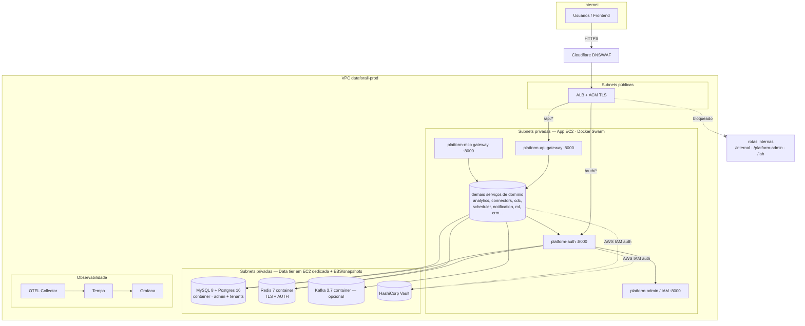
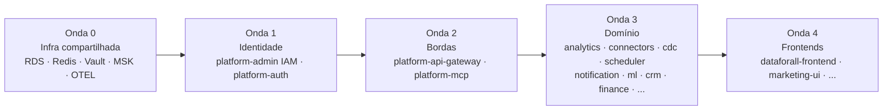
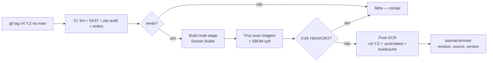
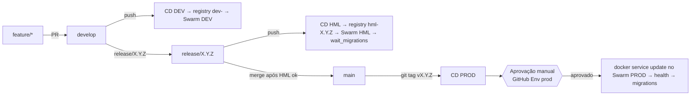
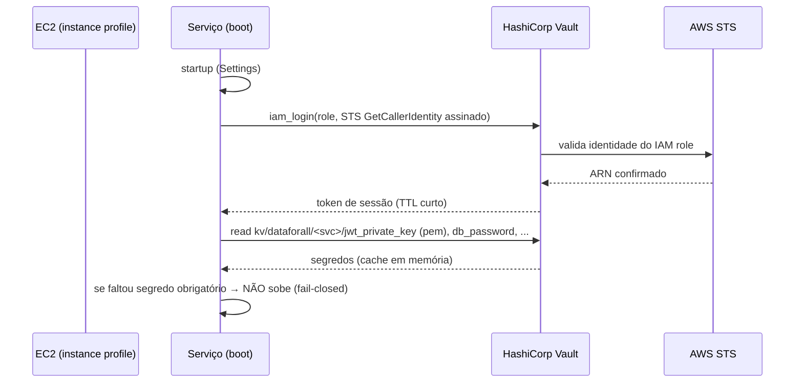
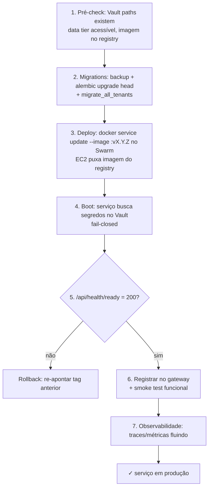
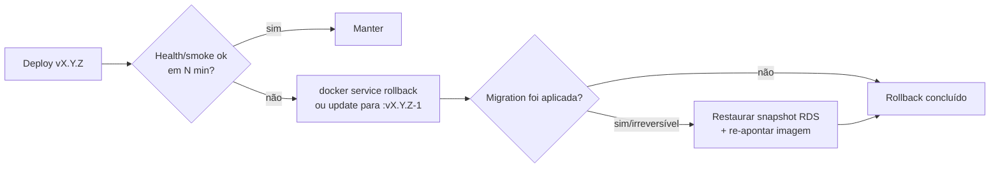

# Playbook de Deploy em Produção — Plataforma DataForAll (AWS)

**Versão:** 2026-07-04 (rev. 2 — alinhada à stack oficial) · **Audiência:** Platform/DevOps, Arquitetura, SRE
**Escopo:** subir **todos** os serviços (`platform-*`, `dataforall-*`) em produção na AWS.

> **Fonte de verdade:** a stack e a topologia são definidas em
> [official-stack-and-architecture.md](../architecture/official-stack-and-architecture.md).
> Decisões-chave desta plataforma: **stateful roda em container em EC2 dedicada com
> hardening** (não RDS/ElastiCache/MSK); **ACR hoje → ECR como alvo**; **Cloudflare**
> como DNS/edge → ALB; **MySQL + Postgres** oficiais; **Docker Swarm** (sem
> Portainer) em múltiplas EC2. Este playbook segue essas decisões.

> **Como este playbook está organizado.** As seções 1–3 explicam o *porquê* e o
> alvo (princípios, arquitetura, landing zone). As seções 4–8 são o *como* repetível
> (build → segredos → deploy por serviço → ordem de subida). As seções 9–13 são
> operação (banco, rede, verificação, rollback, checklist). A seção 14 é o
> **roteiro da primeira subida** ponta a ponta. Execute na ordem; cada fase tem
> critério de saída (*gate*) — não avance sem ele.

---

## 0. Contexto e premissa da migração

Hoje o CD real da plataforma dispara um **webhook do Portainer** que recria o stack;
o build vai para o **ACR (Azure)**, o banco é **Azure Database for MySQL** e os
segredos vinham do **Azure Key Vault**. A meta é **100% AWS sobre EC2 (sem
Kubernetes)** e a orquestração passa a ser **Docker Swarm puro** (sem Portainer),
com deploy via `docker stack`/`service update`. Portanto este playbook é, na
prática, uma **migração Azure→AWS** que também troca o CD do webhook do Portainer
pelo deploy nativo do Swarm:

| Componente | Hoje | Alvo definitivo (decisão travada) |
|---|---|---|
| Registro de imagem | ACR `d4all.azurecr.io` | **ACR agora → ECR** (roadmap) |
| Orquestração | Portainer (webhook) | **Docker Swarm** (`docker stack`/`service update`), múltiplas EC2 (≥2 AZs) |
| Banco relacional | Azure DB for MySQL | **MySQL 8 + Postgres 16 em container** (EC2 de dados + hardening §5 da stack) |
| Cache/rate-limit | Redis | **Redis 7 em container** (TLS + AUTH) |
| Mensageria (opc.) | Kafka SASL_SSL | **Kafka 3.7 em container** (RF≥3) |
| Segredos | Azure Key Vault | **HashiCorp Vault KV + AWS IAM auth** (ADR-0006) |
| Borda/TLS/DNS | Ingress + cert | **Cloudflare (DNS/WAF) → ALB + ACM** |
| Observabilidade | OTEL+Tempo+Grafana | **Prometheus + OTEL/Tempo + Grafana** em container |

> Os manifests K8s/Helm nos repos permanecem válidos para uma migração **futura**
> a Kubernetes; hoje **não são o caminho de produção** (o padrão é Docker Swarm).

---

## 1. Princípios (não-negociáveis)

1. **Artefato imutável, promovido, não reconstruído.** A imagem `:vX.Y.Z` testada
   em HML é a **mesma** que vai a PROD (mesmo digest). Nunca rebuildar por ambiente.
2. **Config e segredo fora da imagem.** Imagem é idêntica entre ambientes; o que
   muda é env + segredos do Vault. Isso torna o deploy reprodutível e o rollback trivial.
3. **Fail-closed.** Segredo ausente, chave RSA ausente, DB sem TLS ⇒ o processo
   **não sobe**. Melhor não subir do que subir inseguro (validado no `Settings`).
4. **Least privilege.** Cada EC2/serviço tem um IAM role mínimo; cada credencial de
   banco é dedicada (não `root`); Vault entrega só o path do próprio serviço.
5. **Promoção linear com aprovação.** `dev → hml → prod`; produção exige aprovação
   humana (GitHub Environment `prod` com *required reviewers*).
6. **Todo deploy é reversível.** Rollback = re-apontar para a tag anterior. Nunca
   um deploy sem plano de volta (seção 12).
7. **Backup antes de mudança de schema.** Migração de banco só depois de snapshot
   verificado (seção 9).

---

## 2. Arquitetura alvo na AWS



**Regras de borda:** o ALB expõe **apenas** rotas públicas (`/api/*`, `/auth/*`,
frontend). Rotas `/internal/*`, `/platform-admin/*`, `/lab/*` são **bloqueadas no
ALB** (regra de path → 403) e só acessíveis dentro da VPC. O endpoint JWKS
(`/internal/.well-known/jwks.json`) fica **interno** — os serviços o consomem via
DNS privado.

---

## 3. Pré-requisitos AWS (landing zone)

Provisionar **uma vez** (idealmente por Terraform/IaC versionado). *Gate da seção:
tudo abaixo existe e responde.*

| Recurso | Especificação mínima | Observação |
|---|---|---|
| **VPC** | subnets públicas (ALB) + privadas (app, dados) em ≥2 AZs | isolamento e HA |
| **Security Groups** | ALB→app:8000; app→RDS:3306; app→Redis:6379; app→Vault:8200; app→MSK:9094 | menor privilégio; nada aberto a 0.0.0.0/0 exceto ALB:443 |
| **Registry** | ACR hoje (`d4all.azurecr.io/dataforall/3.0/<svc>`); ECR como alvo | *scan on push* / Trivy |
| **EC2 (app tier)** | cluster **Docker Swarm** em ≥2 EC2/AZs, **IMDSv2** | *instance profile* `platform-<svc>-ec2` |
| **EC2 (data tier)** | EC2 **dedicadas** p/ MySQL/Postgres/Redis/Kafka/Vault, **EBS gp3** + snapshots DLM | hardening §5 da stack oficial |
| **IAM roles** | `platform-<svc>-ec2` (registry read + Vault via IAM) + role do runner CI (OIDC) | sem access keys estáticas |
| **MySQL 8 / Postgres 16** | container em EC2 de dados, **TLS obrigatório**, réplica/standby em outra AZ | admin+tenants (MySQL) e serviços Postgres |
| **Redis 7** | container, *in-transit TLS* + **AUTH token** | rate-limit + JTI blocklist |
| **Kafka 3.7** (opcional) | container, SASL_SSL, RF≥3 | só se `KAFKA_ENABLED=true` |
| **HashiCorp Vault** | EC2 dedicada, KV v2 mount `kv`, **AWS auth** habilitado | ver [vault-kv-setup](https://github.com/dataforalltech/platform-auth/blob/develop/docs/runbooks/vault-kv-setup.md) |
| **ALB + ACM** | HTTPS 443, cert ACM, regras de path | HSTS, redirect 80→443 |
| **Cloudflare** | zona DNS + proxy/WAF → CNAME do ALB | *authenticated origin pulls* p/ travar o ALB |
| **S3** | bucket de logs (`LOG_UPLOAD_*`), backups e artefatos | versionado, bloqueio público |
| **CloudWatch** | log groups + alarmes (CPU, 5xx, health, lag de réplica) | |

**Autenticação do CI na AWS:** use **GitHub OIDC** (`aws-actions/configure-aws-credentials`)
para assumir um role com permissão de `ecr:*Push*` — **sem** `AWS_ACCESS_KEY_ID`
estático nos secrets. Isso substitui `ACR_USERNAME/ACR_PASSWORD`.

---

## 4. Inventário e ordem de subida (ondas)

Serviços têm dependências de runtime; subir fora de ordem gera *readiness* vermelho
em cascata. Suba em **ondas**, só avançando quando a onda anterior está *ready*.



| Onda | O que sobe | Depende de | *Gate* para avançar |
|---|---|---|---|
| 0 | RDS, ElastiCache, Vault (segredos gravados), MSK, OTEL/Tempo/Grafana | landing zone | `vault kv get` ok; RDS/Redis acessíveis da subnet app |
| 1 | `platform-admin` (IAM) + `platform-auth` | Onda 0 | `/api/health/ready`=200 nos dois; JWKS publica `kid`; login de teste ok |
| 2 | `platform-api-gateway`, `platform-mcp` | Onda 1 (JWKS/JWT) | gateway roteia; `/mcp/tools/list` autentica via Twin Token |
| 3 | serviços de domínio (todos os demais `platform-*`) | Ondas 1–2 | cada serviço *ready*; registrado no gateway |
| 4 | frontends | Ondas 1–3 | login end-to-end pelo ALB |

> **Por que auth e admin juntos na Onda 1:** o `platform-auth` delega validação de
> credenciais ao `platform-admin` (IAM), e os demais serviços verificam JWT via JWKS
> do `platform-auth`. Os dois podem oscilar em *readiness* até ambos subirem — é
> esperado; o *gate* é os dois estáveis.

---

## 5. Fluxo de build e publicação (CI → ECR)

Uma imagem por tag semver, reusada em todos os ambientes. **Hoje o registry é ACR**
(mantido); o bloco abaixo mostra o **alvo ECR + OIDC** (roadmap D3). Até a migração,
mantém-se o login ACR atual — só o `REGISTRY` e o passo de login mudam.



**Mudanças concretas no `cd-prod.yml`** (por serviço, herdadas do template):

```yaml
env:
  REGISTRY: <ACCOUNT_ID>.dkr.ecr.sa-east-1.amazonaws.com   # era d4all.azurecr.io
  IMAGE_PREFIX: dataforall/3.0

# substitui "Log in to ACR":
- uses: aws-actions/configure-aws-credentials@v4
  with:
    role-to-assume: arn:aws:iam::<ACCOUNT_ID>:role/gha-ecr-push
    aws-region: sa-east-1
- uses: aws-actions/amazon-ecr-login@v2
# adicionar antes do push (supply-chain — fecha lacuna da auditoria):
- name: Trivy scan
  uses: aquasecurity/trivy-action@<PINNED_SHA>   # pin por SHA (CI-SEMGREP-SHA-01)
  with: { image-ref: '${{ steps.meta.outputs.image_full }}', severity: 'HIGH,CRITICAL', exit-code: '1' }
```

> **Gate da seção 5:** imagem `:vX.Y.Z` no ECR, com scan limpo e SBOM anexado.

---

## 6. Fluxo de promoção dev → hml → prod



| Ambiente | Trigger | `ENV_PROFILE` / `APP_ENV` / `RUNTIME_ENV` | Aprovação |
|---|---|---|---|
| dev | push `develop` | `cloud-dev` / `dev` / `cloud` | automática |
| hml | push `release/**` | `cloud-hml` / `hml` / `cloud` | automática (com *migration polling*) |
| prod | tag `v*.*.*` | `cloud-prod` / `prod` / `cloud` | **manual (required reviewers)** |

---

## 7. Entrega de segredos em produção (Vault + AWS IAM auth)

Já implementado (ver ADR-0006 e [vault-kv-setup](https://github.com/dataforalltech/platform-auth/blob/develop/docs/runbooks/vault-kv-setup.md)).
Nenhum segredo em imagem, env do stack ou `.env`. A EC2 se autentica no Vault
pelo **IAM role do instance profile** — sem token estático.



Env por serviço (no stack file do Swarm, **não** contém segredos):
```bash
VAULT_ADDR=https://vault.dataforall.internal:8200
VAULT_AUTH_METHOD=aws
VAULT_AWS_ROLE=<service>          # ex.: platform-auth
AWS_REGION=sa-east-1
```

> **Gate da seção 7:** `vault kv get kv/dataforall/<svc>/...` retorna os segredos e
> um pod de teste do serviço autentica via IAM (sem `VAULT_TOKEN`).

---

## 8. Deploy de um serviço (loop repetível para todos)

Este é o procedimento **por serviço** — o mesmo para os ~62 serviços, respeitada a
ordem das ondas (seção 4).



**Detalhe de cada passo e o porquê:**

1. **Pré-check** — evita *deploy* que sobe e cai: confirmar que os paths do Vault
   do serviço existem, que MySQL/Postgres/Redis respondem da subnet, e que a tag existe no registry.
2. **Migrations** — *sempre* após backup do store (seção 9). O init/entrypoint roda
   `alembic upgrade head`; para multi-tenant, `scripts/migrate_all_tenants.py`.
3. **Deploy** — o CD conecta a um manager do Swarm (SSH/runner self-hosted) e roda
   `docker service update --image ...:vX.Y.Z` (ou `docker stack deploy`); a EC2 puxa
   do registry (ACR hoje; no alvo ECR, via *instance profile*). Imagem imutável;
   rolling update nativo do Swarm.
4. **Boot** — o serviço autentica no Vault (IAM) e carrega segredos; se faltar
   obrigatório, **não** fica *ready* (proposital).
5. **Health gate** — `/api/health/ready` valida DB e dependências. Vermelho ⇒
   rollback imediato (não deixar tráfego chegar).
6. **Registro + smoke** — o serviço aparece no registry do gateway; rodar 1–2
   chamadas funcionais reais (não só health).
7. **Observabilidade** — confirmar traces no Tempo e métricas no Grafana antes de
   declarar concluído.

---

## 9. Banco de dados e migrations (MySQL/Postgres em container, multi-tenant)

**Modelo:** o plano **MySQL** tem um banco **admin** (`ADMIN_DATAFORALL` — registry
de tenants, internal tokens) e um banco **por tenant**; serviços Postgres têm seu
próprio banco. Ver a regra polyglot na [stack oficial §4](../architecture/official-stack-and-architecture.md#4-regra-oficial-de-persistência-polyglot-d2).

**Ordem obrigatória:**
1. **Snapshot EBS + dump lógico** do store (verificado) — *gate*: backup restaurável.
   Como o banco é container, o snapshot é do **volume EBS** de dados + `mysqldump`/
   `pg_dump` para S3 (padrão de hardening §5 da stack).
2. **TLS obrigatório** — `DB_SSLMODE=verify-full` (Postgres) /
   `require_secure_transport=ON` (MySQL) — corrige NETW-001 da auditoria.
3. `alembic upgrade head` (schema admin + shared).
4. `python scripts/migrate_all_tenants.py` (ou `--tenant-id <id>` para incremental).
5. Validar `alembic current` == head e *smoke* de leitura/escrita.

```bash
# credenciais vêm do Vault em runtime; para operação manual, exporte da sessão Vault
python scripts/migrate_all_tenants.py --dry-run     # simula
python scripts/migrate_all_tenants.py               # aplica a todos os tenants
```

> **Rollback de migration:** `alembic downgrade -1` **apenas** se a migration for
> reversível; caso contrário, restaurar o snapshot. Por isso o snapshot é *gate*.

---

## 10. Rede, TLS, DNS e exposição

- **ALB** termina TLS (ACM), redireciona 80→443, adiciona **HSTS**.
- **Regras de path no ALB:** `/api/*` e `/auth/*` → target group app; `/internal/*`,
  `/platform-admin/*`, `/lab/*` → **403 fixo** (nunca expor). JWKS é interno.
- **CORS** por serviço: `CORS_ALLOWED_ORIGINS` só com domínios corporativos; o
  `Settings` **recusa `*`** (validado). `DOCS_ENABLED=false`, `AUTH_DEV_BYPASS=false`
  em prod (recusa de boot se violado).
- **DNS interno:** serviços se falam por nome no compose/overlay do Swarm
  (`http://platform-auth:8000`).
- **Multi-tenancy por domínio (crítico):** o `Host` é a identidade do tenant
  (ver [stack §8.1](../architecture/official-stack-and-architecture.md#81-multi-tenancy-por-domínio--o-papel-central-do-dns-d7)).
  Requer **DNS wildcard** `*.dominio.com.br`→ALB, **TLS wildcard**, preservação do
  `Host` (`TRUSTED_PROXIES`) e **ALB só acessível via Cloudflare** (mTLS origin) —
  senão é possível forjar o `Host` e impersonar tenant. Onboarding de tenant =
  `INSERT PLATFORMS.domain` (zero deploy).
- **Security Groups** como firewall: app→dados apenas nas portas necessárias; ALB
  só aceita os IPs da Cloudflare.

---

## 11. Observabilidade e verificação pós-deploy

```bash
# Health externo (pelo ALB)
curl -sf https://api.dataforalltech.com/api/health/ready | jq .

# JWKS (interno) — nova kid presente após rotação de chave
curl -s http://platform-auth:8000/internal/.well-known/jwks.json | jq '.keys[].kid'

# Health por porta dedicada (dentro da EC2)
curl -s http://localhost:9090/health/ready -o /dev/null -w '%{http_code}\n'
```

Confirmar no **Grafana/Tempo** que há traces do serviço e no CloudWatch que não há
pico de 5xx. *Gate final do deploy:* health verde + smoke funcional + traces fluindo.

---

## 12. Rollback e freeze



- **Rollback de app:** `docker service rollback <svc>` (ou `service update` para a
  **tag anterior** — a imagem ainda está no registry). Segundos, sem rebuild.
- **Rollback de schema:** só se reversível; senão restaurar snapshot (por isso a
  seção 9 exige snapshot antes).
- **Freeze:** durante janelas de congelamento (ver `ROLLOUT-FREEZE.md`), nenhum
  `git tag v*` deve ser criado; comunicar no canal de release.

---

## 13. Checklist de produção por serviço (Definition of Done)

Marcar **tudo** antes de considerar um serviço "em produção":

- [ ] Imagem `:vX.Y.Z` no registry, com Trivy limpo e SBOM anexado
- [ ] Paths do Vault do serviço gravados; serviço autentica por **AWS IAM auth**
- [ ] `RUNTIME_ENV=cloud`, `APP_ENV=prod`, `ENV_PROFILE=cloud-prod`
- [ ] `JWT_ALGORITHM=RS256`; chave RSA vem do Vault; JWKS publica `kid`
- [ ] `DB_SSLMODE=verify-full` e RDS com `require_secure_transport=ON`
- [ ] `DOCS_ENABLED=false`, `AUTH_DEV_BYPASS=false`, `LAB_MODE=false`
- [ ] `CORS_ALLOWED_ORIGINS` só domínios corporativos (sem `*`)
- [ ] Credencial de banco **dedicada** (não `root`), rate-limit Redis com auth/TLS
- [ ] Snapshot RDS antes das migrations; `alembic current` == head
- [ ] `/api/health/ready` = 200; smoke funcional passou
- [ ] ALB bloqueia `/internal/`, `/platform-admin/`, `/lab/`
- [ ] Traces no Tempo + métricas no Grafana + alarmes CloudWatch ativos
- [ ] Plano de rollback validado (tag anterior existe no registry)

---

## 14. Roteiro da primeira subida (ponta a ponta)

Execução linear da primeira produção. Cada passo tem *gate*.

1. **Landing zone (seção 3)** — provisionar VPC, SGs, registry, data tier
   (MySQL/Postgres/Redis/Kafka em EC2), Vault, ALB, Cloudflare, IAM roles.
   *Gate:* recursos existem e respondem.
2. **Vault (seção 7)** — habilitar KV v2 + AWS auth; policy + role por serviço;
   gravar segredos. *Gate:* `vault kv get` ok.
3. **Rotacionar segredos comprometidos** — a chave RSA do JWT e credenciais da
   Onda 0 (ver `SECRETS-REMEDIATION-PLAN.md` e o runbook do Vault). *Gate:* segredos
   novos publicados; `gitleaks` limpo.
4. **CI → registry (seção 5)** — buildar `:vX.Y.Z` de cada serviço (ACR hoje;
   migração para ECR+OIDC é roadmap, não bloqueia). *Gate:* imagens com scan limpo.
5. **Onda 0 (infra)** — subir Prometheus/OTEL/Tempo/Grafana; validar
   MySQL/Postgres/Redis/Kafka em container. *Gate:*
   observabilidade recebendo dados.
6. **Onda 1 (identidade)** — migrations do admin + auth (snapshot antes); subir
   `platform-admin` e `platform-auth`. *Gate:* login de teste + JWKS ok.
7. **Onda 2 (bordas)** — `platform-api-gateway` e `platform-mcp`. *Gate:* rota
   pública responde; `/mcp/tools/list` autentica.
8. **Onda 3 (domínio)** — cada serviço pelo loop da seção 8. *Gate:* checklist
   (seção 13) por serviço.
9. **Onda 4 (frontends)** — subir e validar **login end-to-end pelo ALB**. *Gate:*
   fluxo completo de usuário funciona.
10. **Verificação global** — dashboards verdes, sem 5xx, alarmes armados. *Gate:*
    janela de observação estável (ex.: 60 min) sem incidente.

---

## 15. Anexos

### 15.1 Mapa de portas
| Porta | Uso |
|---|---|
| 8000 | HTTP do serviço (container) |
| 9090 | Health dedicado (`/health/live`, `/health/ready`) |
| 28xxx | MCP server do serviço (ex.: 28001 platform-auth) |
| 3306 | RDS MySQL |
| 6379 | ElastiCache Redis |
| 8200 | HashiCorp Vault |
| 9094 | MSK Kafka (opcional) |

### 15.2 Variáveis por ambiente (essenciais)
| Variável | dev | hml | prod |
|---|---|---|---|
| `RUNTIME_ENV` | cloud | cloud | cloud |
| `APP_ENV` | dev | hml | prod |
| `ENV_PROFILE` | cloud-dev | cloud-hml | cloud-prod |
| `JWT_ALGORITHM` | RS256 | RS256 | RS256 |
| `DB_SSLMODE` | require | verify-full | verify-full |
| `DOCS_ENABLED` | true | false | false |
| `AUTH_DEV_BYPASS` | false | false | false |
| `VAULT_AUTH_METHOD` | aws/token | aws | aws |

### 15.3 Referências
- ADR-0006 — [Entrega de segredos via Vault KV](https://github.com/dataforalltech/platform-auth/blob/develop/docs/decisions/adr-0006-vault-kv-secret-delivery.md)
- Runbook Vault — [vault-kv-setup](https://github.com/dataforalltech/platform-auth/blob/develop/docs/runbooks/vault-kv-setup.md)
- Deploy do serviço de referência — [platform-auth/DEPLOY.md](https://github.com/dataforalltech/platform-auth/blob/develop/DEPLOY.md)
- Remediação de segredos — `SECRETS-REMEDIATION-PLAN.md`
- Congelamento de rollout — `ROLLOUT-FREEZE.md`
- Governança/ISO — `governance/`
```
